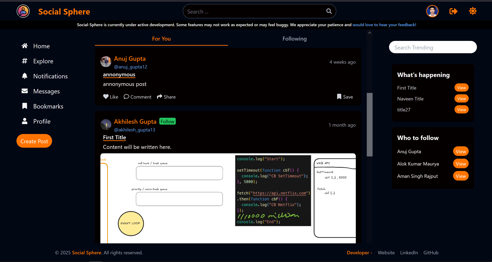
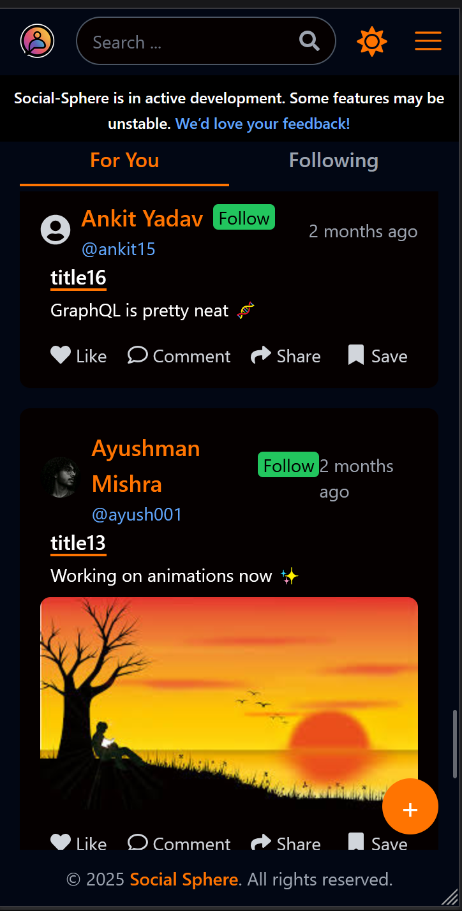
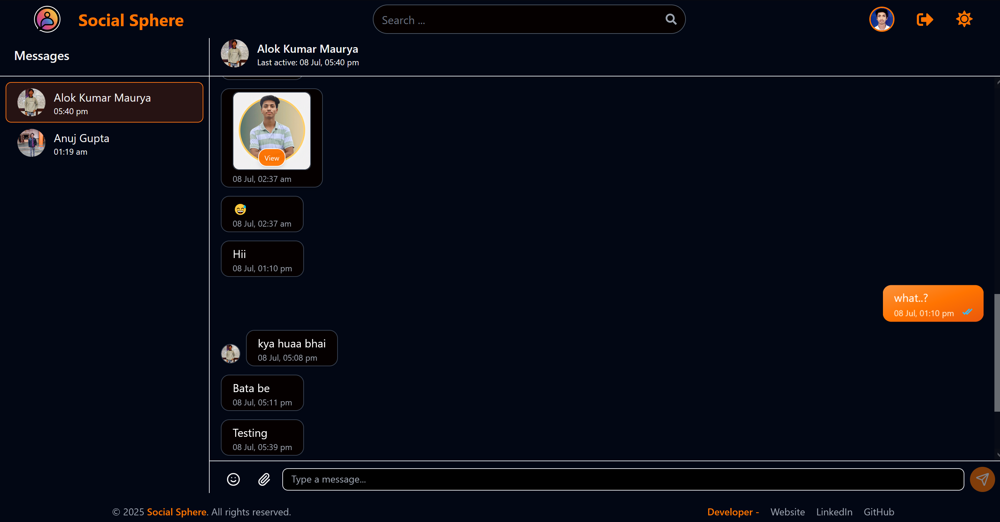
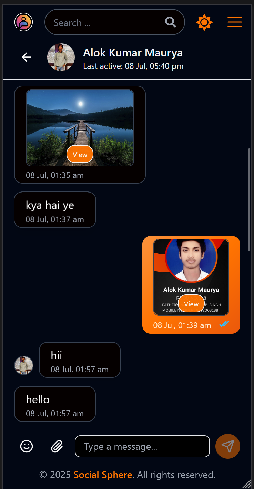
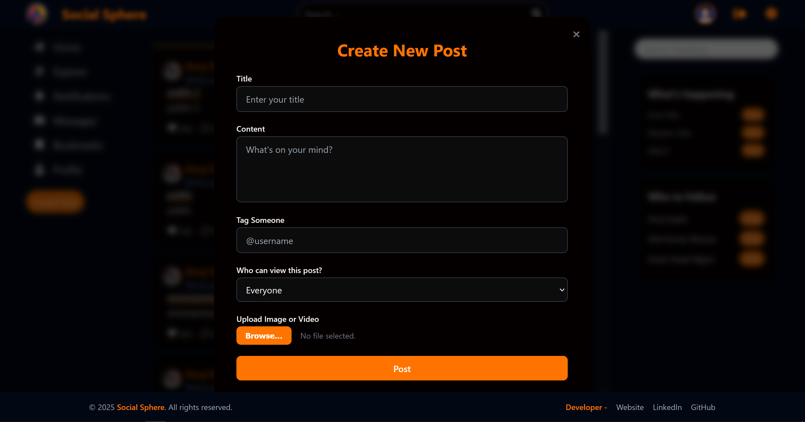
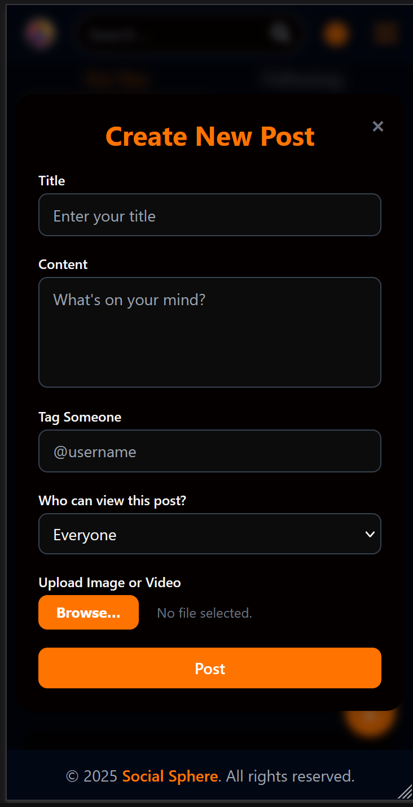
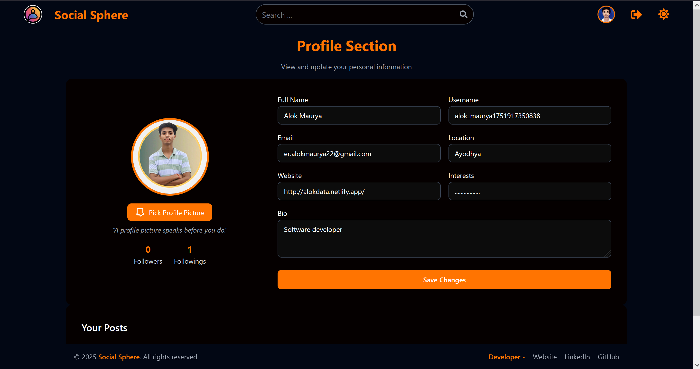
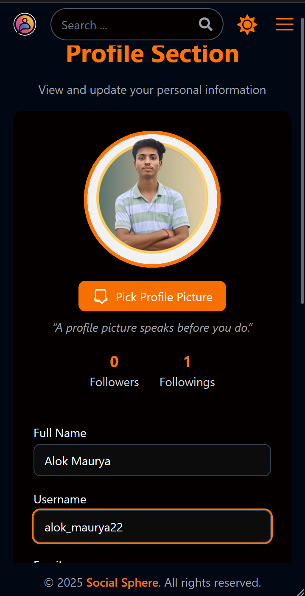

# 🌐 Social Sphere

[Live Preview](https://social-sphere-self.vercel.app/)

**Social Sphere** is a modern, full-stack, web-based social media platform that fosters meaningful connections through real-time chat, user-generated content, and a responsive, intuitive UI. Whether you're a guest exploring the app or a registered user diving fully into the experience, Social Sphere puts **community** and **usability** first.

---

## 🚀 Features

- **📝 Create Posts** – Share thoughts, media (images/videos), tag users, and control post visibility (public, friends-only, private, or drafts).
- **📰 Feed Tabs** – Personalized feed with "For You" and "Following". Includes infinite scroll and real-time updates.
- **❤️ Post Interactions** – Like, comment, share (to chat), and bookmark posts. Threaded comment replies supported.
- **💬 Real-Time Chat** – One-on-one DM style messaging with emoji support, media/files, timestamps, and read receipts.
- **👤 User Profiles** – Update profile with picture, bio, website, location, and more. View other users' content and follow them.
- **👣 Followers System** – Follow/unfollow directly from posts or profile. View and manage Following/Followers.
- **🧪 Guest Sessions** – Explore with limited access for 5 minutes. Registration prompt shown after timeout.
- **🔐 Authentication** – Secure login/signup using Firebase Authentication with email/password or Google.
- **🔖 Bookmarks** – Save posts to revisit later. Fully searchable and scrollable.
- **🔎 Global Search** – Search by username or name; see smart suggestions.
- **🌓 Theme Toggle** – Switch between dark/light modes — saved locally per user.
- **📱 Responsive UI** – Adapted layouts for mobile, tablet, and desktop.
- **🔀 Routing** – Protected and dynamic routes powered by React Router.
- **🔔 Notifications** _(Coming Soon)_

---

## 🧱 Tech Stack

**Frontend**

- React.js
- Tailwind CSS
- Vite
- React Router
- Emoji Picker
- Toastify
- Lucide React
- React Icons

**Backend / Services**

- Firebase Authentication
- Firestore (NoSQL Database)
- Firebase Storage

**Utilities**

- Image Compression
- Infinite Scroll
- Context API

---

## 🗺️ Main Pages & User Flows

- **Home** – Feed, Post creator, trends/groups sidebars
- **Explore** _(Planned)_ – Trending tags and user discovery
- **Bookmarks** – Saved posts archive
- **Chats** – Real-time conversation dashboard
- **Own Profile** – View/edit personal profile & posts
- **Other Users' Profiles** – Follow and chat options
- **Post Detail View** – Interact with full post/comments
- **Auth (Login/Signup)** – Auth pages, with guest timer pause
- **Followers Modal** – Manage followers & followings easily

---

## 🧑‍💻 How It Works

1. **⛔ Guest Access**  
   Non-registered users can browse for 5 minutes. Banner/timer reminds them to log in or sign up.

2. **✅ Authentication**  
   Users create accounts via email/password or Google OAuth, with secure Firebase-backed session handling.

3. **📨 Post & Chat**  
   Share content or message real-time with emojis, images, and files. User-friendly interactions like liking, commenting or sharing available.

4. **🪪 Profile Control**  
   Customize avatar, bio, website, interests, and more. View and follow others too.

5. **🔍 Discover People**  
   Smart search to instantly find users from their name or handle.

6. **💡 Theme Switching**  
   Toggle between themes across sessions and devices.

---

## 🛠️ Setup & Installation

> Pre-requisites: Node.js, Firebase Project setup

```bash
# Clone the repository
git clone https://github.com/alokmaurya22/SocialSphere.git
cd DEV_CONNECT/social-sphere

# Install project dependencies
npm install

# Firebase Setup: Open src/configuration/firebaseConfig.js,
# and add your Firebase config values – ensure:
# 🔹 Authentication 🔹 Firestore 🔹 Storage are enabled

# Start development server
npm run dev

# For production build
npm run build

```

# 🤝 Contribution & Feedback

Thank you for considering contributing to **Social Sphere**!  
We're building 🚧 this platform actively, and your input **matters a lot**.

---

## 🗣 Send Us Your Feedback

Have suggestions, request features, or spot room for improvement?

👉 [Send feedback through the app](https://social-sphere-self.vercel.app/)

---

## 🐛 Found a Bug?

Please help us improve the platform by reporting bugs.  
You can open a GitHub issue:

🔗 [Open an Issue](https://github.com/alokmaurya22/SocialSphere/issues)

Use one of the issue templates to:

- Report a bug 🐞
- Request a feature ✨
- Ask a question ❓

---

## ⭐ Support the Project

If you like **Social Sphere** or find it useful, please consider giving a star:

🌟 [Star this repo on GitHub](https://github.com/alokmaurya22/SocialSphere)

Your support helps keep the project going and visible to others 🚀

---

## 📄 License

You are free to use, copy, modify, merge, publish, it under the terms of the license.
But can't use for monitory purposes. It cant be sell to anyone. If you want please connect to developer. [Gmail ](er.alokmaurya22@gmail.com)

---

## 🔗 Developer Info

Built and maintained with 💻 by [Alok Maurya](https://github.com/alokmaurya22)

- 🌐 [Portfolio Website](http://alokdata.netlify.app/)
- 💼 [LinkedIn](https://www.linkedin.com/in/alokmaurya22/)
- 💻 [GitHub](https://github.com/alokmaurya22)

---

> _"A profile picture speaks before you do." – Social Sphere Team_

## Screenshots

Below are screenshots of the Social Sphere app:


_Browse Page on Desktop_


_Browse Page on Mobile_


_Chat Page on Desktop_


_Chat Page on Mobile_


_Create Post Modal on Desktop_


_Create Post Modal on Mobile_


_Profile Page on Desktop_


_Profile Page on Mobile_
